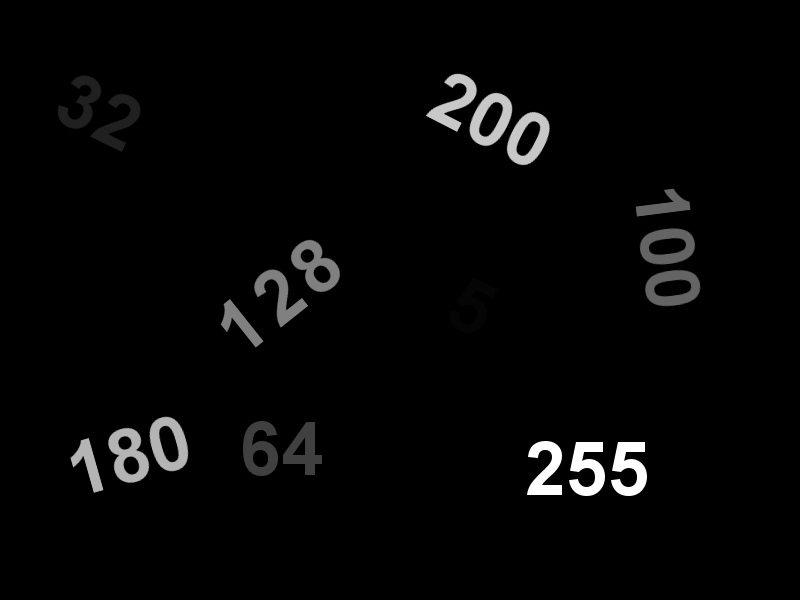
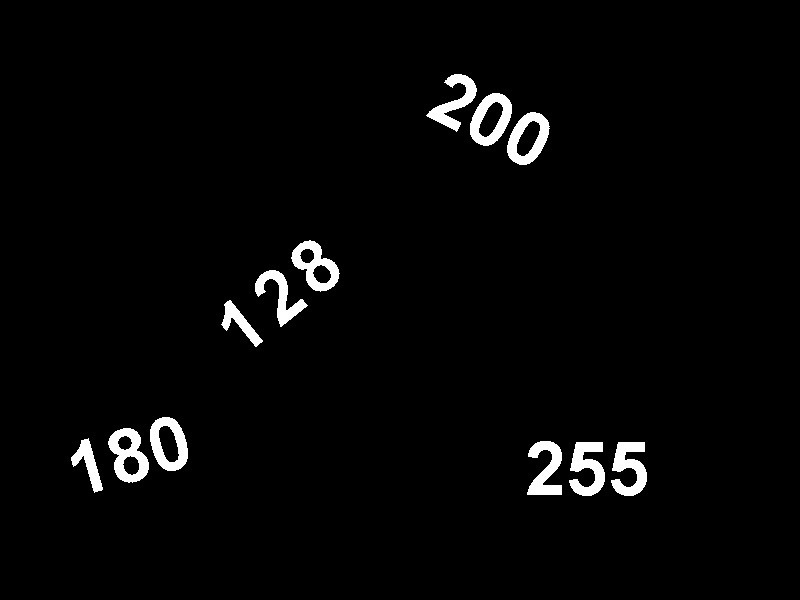

## Binary Image Processing

#### Thresholding:
#### **thresholding.ipynb**
This code is used to threshold the image. Three different techniques are used:
1) Using for loop
2) Using vectorization (numpy array)
3) Using OpenCV function
Timing performance is compared for the above techniques.

Source Image: 

Thresholded Image:

