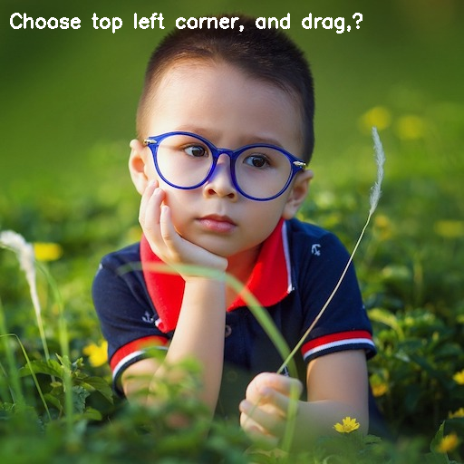
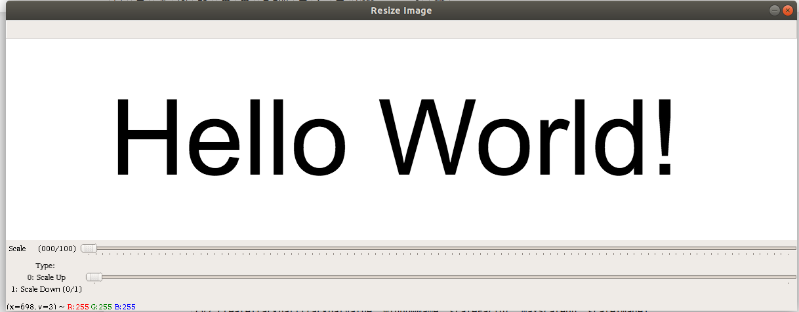
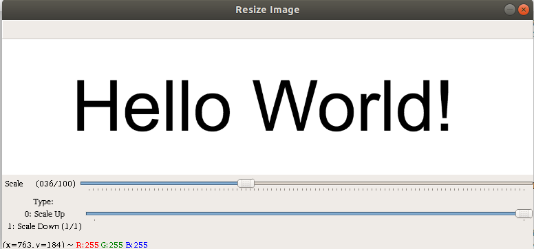

## **FaceAnnotationTool.ipynb**
This code is used to select and crop any section of the image (like the face). Draw a rectange using mouse left button and the image under the rectangular region will be cropped and saved.

Source Image: 

Marked Image:

ROI Image:

## **trackbarAsController.ipynb**
This code creates two trackbars. Lower track bar is be used to determine if the user wants to scale up or scale down the image. Upper track bar determines the amount of scaling.

ScaledUp Image:

ScaledDown Image:

